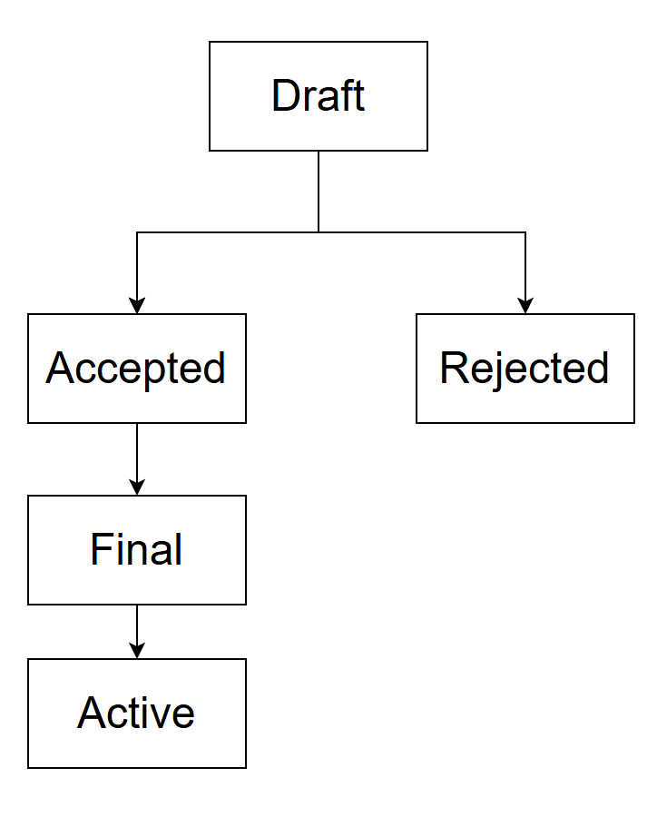

```markdown
SPEP: 0
Title: SPEP Purpose and Guidelines
Author: SpoonOS Core Team
Type: Process
Status: Draft
Created: 2025-8-19
Level: N/A
```

# Table of Contents

- [What is a SPEP](#what-is-a-spep)
- [Motivation](#motivation)
- [SPEP Types](#spep-types)
- [SPEP Workflow](#spep-workflow)
- [SPEP Status](#spep-status)
- [What belongs in a successful SPEP?](#what-belongs-in-a-successful-spep)
- [SPEP Template](#spep-template)
- [Submission Process](#submission-process)
- [Rewards Structure](#rewards-structure)
- [SPEP Editors](#spep-editors)
- [SPEP Editor Responsibilities & Workflow](#spep-editor-responsibilities--workflow)
- [Resources](#resources)

## What is a SPEP?

SPEP stands for SpoonOS Enhancement Proposal, a standardized process for submitting, reviewing, and implementing proposals for the SpoonOS ecosystem. SPEP aims to provide a structured framework for community contributions to SpoonOS development.

## Motivation

As the SpoonOS ecosystem grows, a standardized process for proposing and implementing changes becomes essential. The SPEP framework ensures that all proposals are thoroughly documented, properly reviewed, and efficiently implemented, leading to higher quality contributions and a more robust ecosystem.

## SPEP Types

There are three types of SPEP:

- A **Standard Track** SPEP describes any change that affects most or all SpoonOS implementations, such as a change to the core protocol, a change in component interaction rules, proposed application standards/conventions, or any change or addition that affects the interoperability of applications using SpoonOS.

- An **Informational** SPEP describes a SpoonOS design issue, or provides general guidelines or information to the SpoonOS community, but does not propose a new feature. Informational SPEPs do not necessarily represent a SpoonOS community consensus or recommendation, so users and implementors are free to ignore Informational SPEPs or follow their advice.

- A **Process** SPEP describes a process surrounding SpoonOS or proposes a change to (or an event in) a process. Process SPEPs are like Standard Track SPEPs but apply to areas other than the SpoonOS protocol itself. They may propose an implementation, but not to SpoonOS's codebase; they often require community consensus; unlike Informational SPEPs, they are more than recommendations, and users are typically not free to ignore them. Examples include procedures, guidelines, changes to the decision-making process, and changes to the tools or environment used in SpoonOS development.

## SPEP Workflow

The SPEP process begins with a new idea for SpoonOS. It is highly recommended that a single SPEP contain a single key proposal or new idea. The more focused the SPEP, the more successful it tends to be. A change to one component doesn't require a SPEP; a change that affects multiple components, or defines a standard for multiple apps to use, does. The SPEP editor reserves the right to reject SPEP proposals if they appear too unfocused or too broad. If in doubt, split your SPEP into several well-focused ones.

Each SPEP must have a champion - someone who writes the SPEP using the style and format described below, shepherds the discussions in the appropriate forums, and attempts to build community consensus around the idea.

Vetting an idea publicly before going as far as writing a SPEP is meant to save the potential author time. Asking the SpoonOS community first if an idea is original helps prevent too much time being spent on something that is guaranteed to be rejected based on prior discussions. It also helps to make sure the idea is applicable to the entire community and not just the author. Just because an idea sounds good to the author does not mean it will work for most people in most areas where SpoonOS is used. Examples of appropriate public forums to gauge interest around your SPEP include the [SpoonOS Discord community](https://discord.gg/G6y3ZCFK4h), the Issues section of this repository, and relevant community channels.

The SPEP process follows these stages:

1. **Idea**: Initial concept discussion in the community forums
2. **Draft**: The author submits a draft SPEP as a pull request. This gives the author a chance to continuously edit the draft SPEP for proper formatting and quality.
3. **Review**: SpoonOS core team evaluation of the proposal. This also allows for further public comment and the author of the SPEP to address concerns about the proposal.
4. **Accepted**: The SPEP is accepted for implementation.
5. **Implementation**: Development of the proposed solution
6. **Final**: Completed implementation with documentation and tests

If the SPEP collaborators approve, the SPEP editor will assign the SPEP a number, label it as Standard Track, Informational, or Process, give it status "Draft", and add it to the git repository. The SPEP editor will not unreasonably deny a SPEP. Reasons for denying SPEP status include duplication of effort, being technically unsound, not providing proper motivation or addressing backwards compatibility, or not in keeping with the SpoonOS philosophy.

# SPEP Status

Each SPEP has one of the following statuses:

- **Draft**: The initial proposal submission
- **Accepted**: Approved for implementation
- **Final**: Successfully implemented and integrated
- **Deferred**: Postponed for future consideration
- **Rejected**: Not accepted for implementation
- **Withdrawn**: Removed by the author
- **Replaced**: Superseded by another SPEP
- **Active**: Some Informational and Process SPEPs may also have a status of "Active" if they are never meant to be completed. E.g. SPEP 0 (this SPEP).

The possible paths of the status of SPEPs are as follows:



## What belongs in a successful SPEP?

Each SPEP should have the following parts:

1. **Preamble** - RFC 822 style headers containing metadata about the SPEP, including the SPEP number, a short descriptive title, the names and contact info for the authors, etc.

2. **Abstract** - A short (~200 word) description of the technical issue being addressed.

3. **Motivation** - The motivation is critical for SPEPs that want to change the SpoonOS protocol. It should clearly explain why the existing protocol specification is inadequate to address the problem that the SPEP solves. SPEP submissions without sufficient motivation may be rejected outright.

4. **Rationale** - Rationale – The rationale fleshes out the specification by describing why particular design decisions were made. It should describe alternate designs that were considered and related work, e.g. how the feature is supported in other AI framework.

5. **Technical Specification** - The technical specification should describe the syntax and semantics of any new feature. The specification should be detailed enough to allow competing, interoperable implementations for any of the current SpoonOS platforms.

6. **Backwards Compatibility** - All SPEPs that introduce backwards incompatibilities must include a section describing these incompatibilities and their severity. The SPEP must explain how the author proposes to deal with these incompatibilities.

7. **Security Considerations** - All SPEPs must contain a section that discusses the security implications/considerations relevant to the proposed change. Include information that might be important for security discussions, surfaces risks and can be used throughout the life cycle of the proposal.

8. **How to Teach This** – For a SPEP that adds new functionality or changes language behavior, it is helpful to include a section on how to teach users, new and experienced, how to apply the SPEP to their work. This section may include key points and recommended documentation changes that would help users adopt a new feature or migrate their code to use a language change.

9. **Reference Implementation** - The reference implementation must be completed before any SPEP is given status "Final", but it need not be completed before the SPEP is accepted. It is better to finish the specification and rationale first and reach consensus on it before writing code.

## SPEP Template

SPEPs should be written in markdown format. For a complete template, please refer to the file [SPEP-X.md](./SPEPs/SPEP-X.md) in the repository. This template includes all necessary sections and formatting guidelines for creating a new SPEP.

The template includes metadata fields (SPEP number, title, author, type, status, dates), as well as sections for Abstract, Motivation, Problem Description, Business Opportunity, Technical Specification, Implementation Plan, Backwards Compatibility, Test Cases, Reference Implementation, Security Considerations, and Copyright notice.

## Submission Process

The following is the standardized process for submitting a new SPEP:

1. **Discuss the idea** - Before writing a formal SPEP, discuss your idea in the [SpoonOS Discord community](https://discord.gg/G6y3ZCFK4h) to get initial feedback.

2. **Fork the repository** - Fork the [SpoonOS SPEP repository](https://github.com/XSpoonAi/spoon-devcall-s1) to your own GitHub account.

3. **Create a new file** - Create a new file in the SPEPs directory following the naming convention `spep-X.md` where X is the next available SPEP number. Use the SPEP template format provided above.

4. **Fill in the template** - Complete all required sections of the template with detailed information about your proposal. Be thorough and clear in your descriptions.

5. **Submit a pull request** - Submit a pull request from your fork to the main repository. In the PR description, provide a brief summary of your SPEP and any relevant context.

6. **Engage in discussion** - Actively participate in the community discussion about your proposal. Be open to feedback and willing to make revisions.

7. **Revise as needed** - Based on feedback from the community and core team, make necessary revisions to your SPEP. Each revision should improve the clarity, completeness, and feasibility of your proposal.

8. **Await review decision** - The SpoonOS core team will evaluate your proposal based on the review criteria outlined below. They may request additional revisions or clarifications.

9. **Implement if accepted** - If your SPEP is accepted, proceed with implementation according to the guidelines provided in this document.

## Rewards Structure

SpoonOS offers three Levels of rewards for contributions:

- **S Level ($1600)**: For significant contributions that have a major impact on the SpoonOS ecosystem. These include implementing core protocol changes, creating new foundational components, or developing solutions that substantially enhance security, scalability, or interoperability across the ecosystem.

- **A Level ($800)**: For valuable contributions that have a positive impact on the SpoonOS community. These include developing new features, creating comprehensive documentation, implementing significant improvements to existing components, or building tools that enhance developer experience.

- **B Level ($400)**: For minor contributions that have a modest impact on the SpoonOS ecosystem. These include bug fixes, small feature enhancements, documentation improvements, or quality-of-life updates that improve usability.

## SPEP Editors

The current SPEP editors are:

- SpoonOS Core Team

## SPEP Editor Responsibilities & Workflow

For each new SPEP that comes in, an editor does the following:

- Read the SPEP to check if it is ready: sound and complete. The ideas must make technical sense, even if they don't seem likely to get to final status.
- The title should accurately describe the content.
- Check the SPEP for language (spelling, grammar, sentence structure, etc.), markup (GitHub flavored Markdown), code style.

If the SPEP isn't ready, the editor will send it back to the author for revision, with specific instructions.

Once the SPEP is ready for the repository, the SPEP editor will:

- Assign a SPEP number (generally the PR number or, if preferred by the author, the Issue # if there was discussion in the Issues section of this repository about this SPEP)
- Merge the corresponding pull request
- Send a message back to the SPEP author with the next step.

Many SPEPs are written and maintained by developers with write access to the SpoonOS codebase. The SPEP editors monitor SPEP changes, and correct any structure, grammar, spelling, or markup mistakes we see.

## Resources

- [SpoonOS Documentation](https://github.com/XSpoonAi/spoon-core)
- [SpoonOS Discord](https://discord.gg/G6y3ZCFK4h)
- [Sample Proposals](./Proposal_Samples/)
- [GitHub Issue Template](https://github.com/XSpoonAi/spoon-devcall-s1/issues/new/choose)

